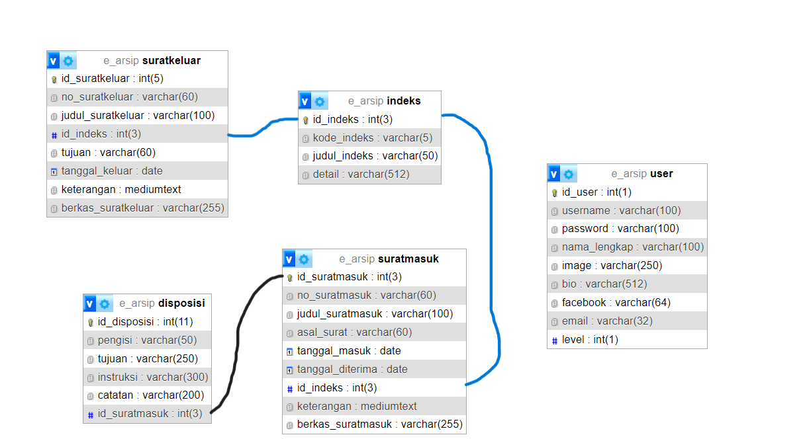

# SISTEM PENGARSIPAN
|                    | Anggota                                  |
|--------------------|------------------------------------------|
|                    | Mohamad Hegar Sukmana Wibowo (312210332) |
|                    | Yudha Purnama Putra (312210352)          |
|                    | Hendra Parsaulian (312210689)            |
|                    | Naza Sefti Prianita (312210306)          |
| Kelas              | TI.22.A.3                                |
| Tugas              | UTS PEMOGRAMAN WEB 2                     |
# D. Rancangan Basis Data (Data Model/ERD)

# E. Prototype (Desain Mockup/Figma)
## Login

## Halaman Utama

## Surat Masuk

## Surat Keluar

## Indeks

## Users

## Profil

## Laporan Surat Masuk

## Laporan Surat Keluar

## Tentang Sekolah
